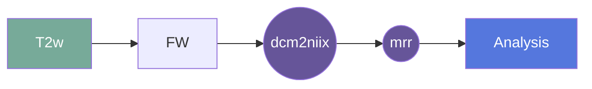

# neoMORPH: A Morphometry Pipeline for Neonatal Low-Field MRI

## Setup

This repository uses Git submodules to manage shared utilities. After cloning the repository, initialize the submodules:

```bash
git submodule update --init --recursive
```

This will populate the `shared/` directory with utilities from the [UNITY-Physics/utils](https://github.com/UNITY-Physics/utils) repository.

## Overview

`neoMORPH` is a Flywheel gear for segmentation and volumetry of **neonatal low-field T2-weighted brain MRI**.

This refactored workflow is neonatal-specific and currently uses a fixed **0-month (0M)** template and priors.

### Pipeline summary

1. Preprocess native input (denoise, bias-correct, brain extraction)
2. Register neonatal native brain to the neonatal template
3. Warp priors and anatomical masks to native space
4. Run `antsAtroposN4.sh` using neonatal priors
5. Refine posterior maps into a final labeled segmentation atlas
6. Generate QC montage images and volume estimates

## Scope and intended use

- Intended for **neonatal scans** (up to 1 month)
- For older infants, use the `MiniMORPH` workflow/gear

## Usage

This script is designed to run as a Flywheel gear and takes one required imaging input:

1. `input` (`.nii` or `.nii.gz`)

### Running outside Flywheel

Copy `app/main.sh` and run it with the input NIfTI path:

```bash
app/main.sh /path/to/input.nii.gz
```

The script expects neonatal template assets and priors under `app/templates/`.

### Cite

**License:** MIT License

**URL:** <https://github.com/UNITY-Physics/fw-neomorph>

**Cite:**  
MiniMORPH: A Morphometry Pipeline for Low-Field MRI in Infants
Chiara Casella, Aksel Leknes, Niall J. Bourke, Ayo Zahra, Daniel Elijah Scheiene, Vanessa Kyriakopoulou, Simone R. Williams, Layla E. Bradford, Joanitta Murungi, Steven C.R. Williams, Sean C.L. Deoni, Victoria Nankabirwa, Kirsten A Donald, Muriel Marisa Katharina Bruchhage, Jonathan O’Muircheartaigh 
medRxiv 2025.07.01.25330469; doi: https://doi.org/10.1101/2025.07.01.25330469

### Classification

*Category:* analysis

*Gear Level:*

* [ ] Project
* [x] Subject
* [x] Session
* [ ] Acquisition
* [ ] Analysis

----

### Inputs

* api-key
  * **Name**: api-key
  * **Type**: object
  * **Optional**: true
  * **Classification**: api-key
  * **Description**: Flywheel API key.

* input
  * **Base**: file
  * **Description**: neonatal low-field input file (typically isotropic T2w reconstruction)
  * **Optional**: false

### Config

This gear currently has no required user-configurable parameters in `manifest.json`.

### Outputs

* output
  * **Base**: file
  * **Description**: final segmentation atlas (`Final_segmentation_atlas.nii.gz`)
  * **Optional**: false

* parcelation
  * **Base**: file
  * **Description**: segmentation/QC artifacts (including montage images)
  * **Optional**: true

* volume
  * **Base**: file
  * **Description**: volume estimation CSV (`All_volumes.csv`)
  * **Optional**: true

#### Metadata

No metadata currently created by this gear.

### Pre-requisites

- Three dimensional structural image

1. ***dcm2niix***
    * Level: Any
2. ***file-metadata-importer***
    * Level: Any
3. ***file-classifier***
    * Level: Any

### Description

This gear runs the neonatal `neoMORPH` segmentation pipeline on Flywheel using a neonatal low-field input image.

After the pipeline is run, segmentation, QC, and volumetry outputs are saved into the analysis container.

### Workflow

A picture and description of the workflow



Description of workflow

1. Upload data to container
2. Prepare data by running the following gears:
   1. file metadata importer
   2. file classifier
   3. dcm2niix
3. Select either a subject or a session.
4. Run the MRR gear (Hyperfine multi-resolution registration)
5. Run the neoMORPH gear

### Use Cases

## FAQ

[FAQ.md](FAQ.md)

## Contributing

[For more information about how to get started contributing to that gear,
checkout [CONTRIBUTING.md](CONTRIBUTING.md).]
